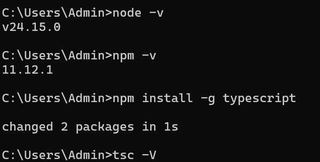

# Typescript installation

- install NodeJS if not installed.

```bash
node -v
npm -v
npm install -g typescript
tsc --version # tsc -V
```


## For setting up TS project environment

- create folder
- move to that folder in terminal (cd project)
- npm init -y (this command will create package.json inside project folder)
- tsc --init ( will create tsconfig.json file inside project folder)

## npx and tsx

1. npx: 
    - runs locally installed packages
    - can temporary download and execute a package if its not installed
    - normally avoids global installations
2. tsx:
    - tsx is NodeJS Runtime which allows you to run Typescript files directly without manually compiling them to JavaScript

    - npx tsx file.ts (It will run ts directly)


## Type vs Interface Summary

- Define object Sturucture use interface
- implement class from interface use interface

**Type**

- works same like interface when to define object structure.
- Existing Datatype to give diffrent name

```ts
type Age = number; // give premitive datatype diffrent name
let sonamage:Age = 45;

// Union Type Possible in Type not in interface
type status = "Pending" | "Approved" | "Rejected"

// Function Type
type Add = (a:number, b:number) =>number

//intersection Type
type Person= {
    name: string
}

type Employee = Person & {
    salary: number
}
```
*Interview Specific: interface is mainly used to structure objects and classes where type alias more flexible to represent objects, primetives, unions, intersection and function types, both are used for object defination but interfaces most focus on object oriented designs whereas type aliases are more preffered for advanced type compositions*