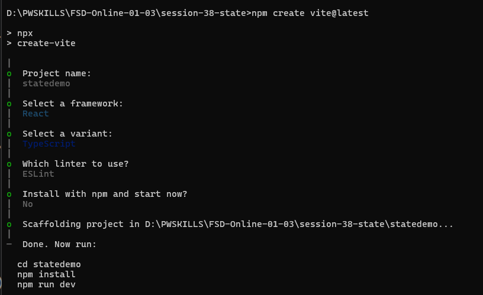
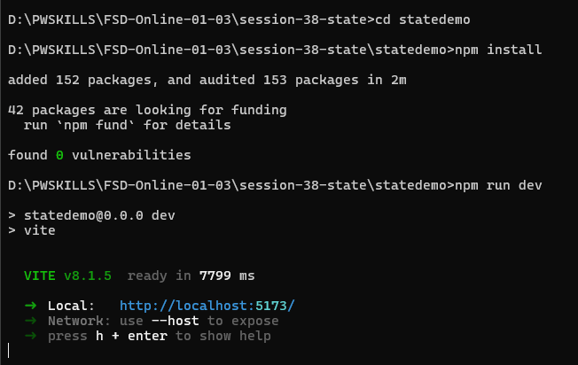
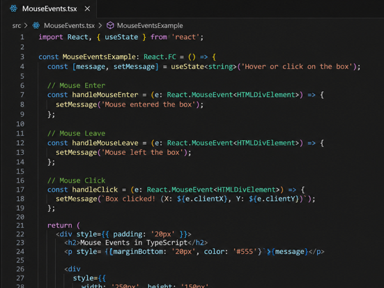

# Create React App

- Node is installed?
- check versions: node -v, npm -v

- create app
- npm create vite@latest



- how to start app

```bash
cd statedemo
npm install
npm run dev
```


- when app started successfully
- open the give url

- http://localhost:5173/


## Practice Task

1. Mouse Event

