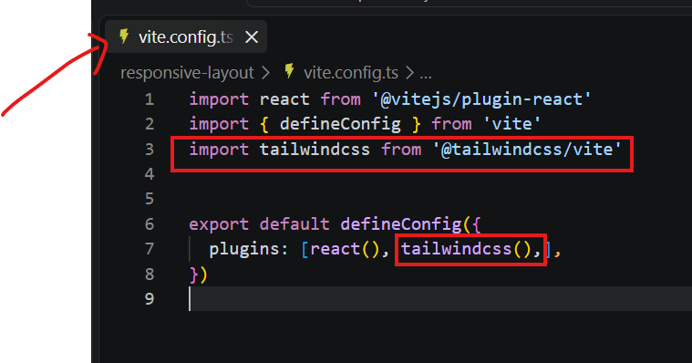

# include Tailwind with React

[Follow this Link](https://tailwindcss.com/docs/installation/using-vite)

```bash
# Create Project
npm create vite@latest my-project
cd my-project

# Install Dependency
npm install tailwindcss @tailwindcss/vite
```

- open vite.config.ts



- open src/index.css and remove all content and add below line
  
```css
@import "tailwindcss";
```

- save all and start project.


## Create Components using tailwind

[Doc Link](https://tailwindcss.com/plus/ui-blocks/documentation/using-react)

- explore Hero Section
- Feature section
- contact
- blog etc..
- check component try to copy code create navigation and see the output