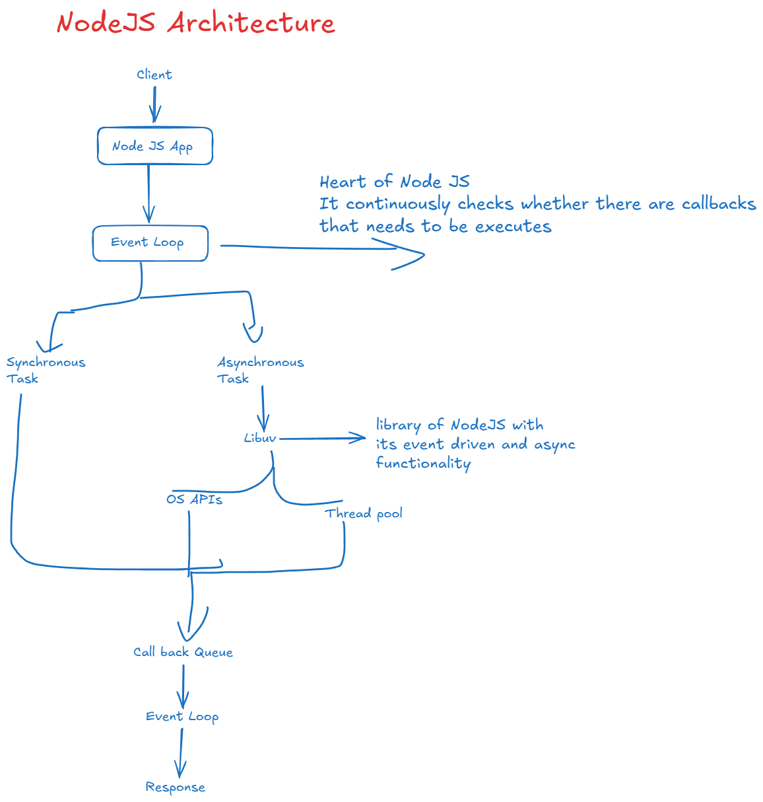
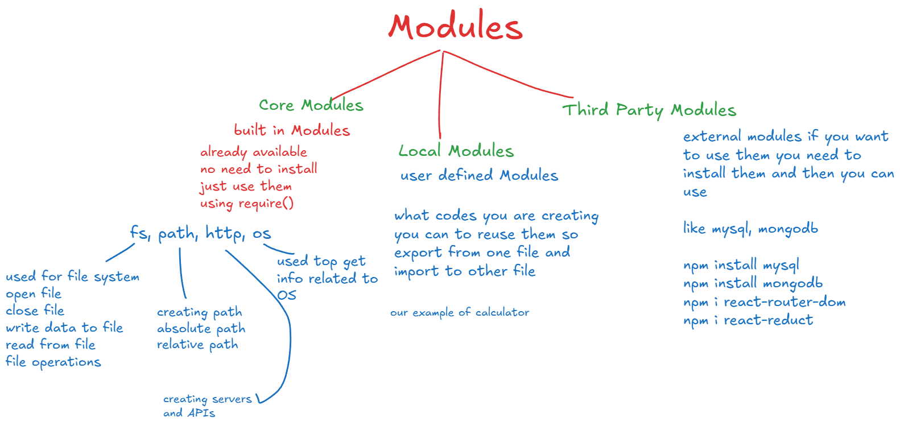
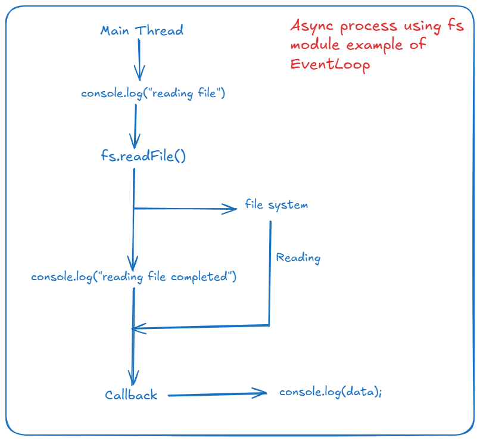

# Node js Understanding

- JavaScript Runtime Environment that allows us to run JS code outside the browser.
- it use Google v8 engine for Javascript execution
- SSS : used for server side scripting

## Architecture



## Let's Install

[Use this link to download](https://nodejs.org/en/download)

### Check Versions

- open any terminal

```bash
node -v
npm -v
```

### Let's create first program

- create file named app.js
- add the code shown here in the file app.js
- run the file terminal: node app.js

## Modules



## Common JS

- It is the by default module
- used for user defined modules
- to export: module.exports
- to import: use require()

- for demo you can create calculator.js and usage.js shown here
- run: node usage.js

### Code Modules

- Inbuilt Modules
- fs (file system)
- it is used to work with file operation
- fs.readFile() method for reading file asynchronously
- Flow of the execution

