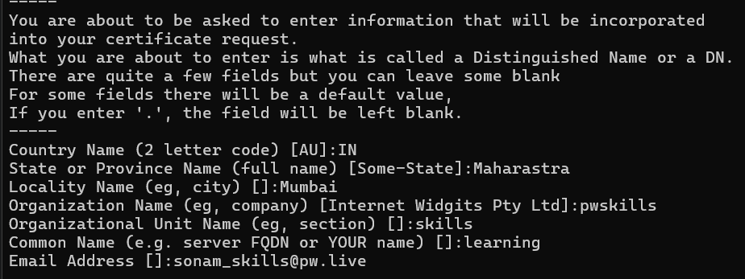
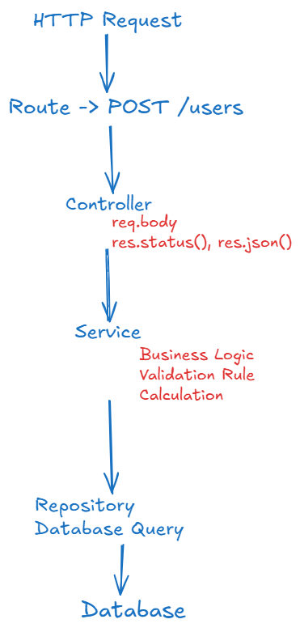

# Install OpenSSL in Mac

- if you already have brew installed then execute below command.
- brew install openssl
- openssl version

# Install OpenSSL in Windows

- https://slproweb.com/products/Win32OpenSSL.html
- download .msi
- install
- set Path -> C:\Program Files\OpenSSL-Win64\bin
- to set go to advanced system settings
- environment variables
- path -> new and paste tha path

- now check from cmd: openssl version

# Let's Genearte Key and Certificate

```bash
openssl req -x509 -newkey rsa:2048 -nodes -keyout key.pem -out cert.pem -days 365
```



## Project Structure



*Constants*

- Contains fixed values
- stores reusable values
- you can cretae ROLES: ADMIN, USER, MANAGER
- you can create status code: HTTP_STATUS.OK, HTTP_STATUS.CREATED
- messages: "User created successfully"

*utils*

- Reusable functions
- performs Same operation
- formatDate(), generateToken(), hashPassword(), calculateTax()

*Controllers handle HTTP, Service handles Business Logic, Repository handles database, Utils handles reusable functions and conctants stores reusable fixed values.*