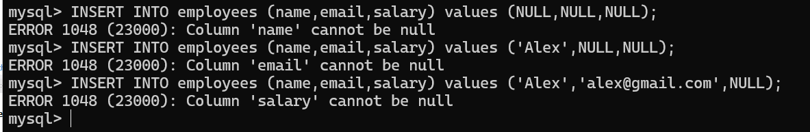
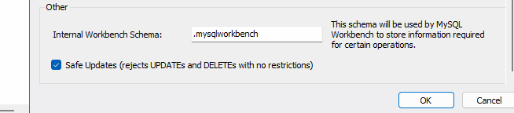

# Creating Tables

```sql
-- check available databases
show databases;

-- creating new database
create database pwskills;

-- use the created database;
use pwskills;

-- create Table
CREATE TABLE students (
	student_id INT PRIMARY KEY,
    name VARCHAR(100),
    email VARCHAR(100),
    age INT,
    course VARCHAR(50)
);

-- check table structure
describe students;
```

## Auto increment

```sql
CREATE TABLE employees (
    emp_id INT PRIMARY KEY AUTO_INCREMENT,
    name VARCHAR(100),
    salary DECIMAL(10,2)
);

describe employees;

-- Insert Records
INSERT INTO employees (name,salary) values ('Sonam Soni',56000.67);
INSERT INTO employees (name,salary) values ('John Cole',96000.67);
INSERT INTO employees (name,salary) values ('Kishori Khadilkar',196000.67);

-- View Data
SELECT * from employees;
```

## NOT NULL

```sql
drop table employees;

CREATE TABLE employees (
    emp_id INT PRIMARY KEY AUTO_INCREMENT,
    name VARCHAR(100) NOT NULL,
    email VARCHAR(100) NOT NULL,
    salary DECIMAL(10,2) NOT NULL
);

INSERT INTO employees (name,email,salary) values ('Sonam Soni','sonam@gmail.com',56000.67);
INSERT INTO employees (name,email,salary) values ('John Cole','john@gmail.com',96000.67);
INSERT INTO employees (name,email,salary) values ('Kishori Khadilkar','kishori@gmail.com',196000.67);

-- View Data
SELECT * from employees;
```


**Notes**
- to empty table: truncate table table_name;
- to delete entire table drop table table_name;

## Unique

```sql
-- In above table If I do below execution, Record will be inserted
INSERT INTO employees (name,email,salary) values ('John Doe','sonam@gmail.com',46000.67);

-- to secure use unique constraint

CREATE TABLE Users (
    user_id INT PRIMARY KEY AUTO_INCREMENT,
    name VARCHAR(100) NOT NULL,
    email VARCHAR(100) NOT NULL UNIQUE,
    username VARCHAR(100) NOT NULL UNIQUE
);

INSERT INTO users (name,email,username) values ('Sonam','sonam@gmail.com','sonamsoni14');
INSERT INTO users (name,email,username) values ('sonam soni','sonam@gmail.com','sonamsoni14');
-- here you can see error for duplicate entry

SELECT * from users;

```
## Foreign Key

- 1 table primary key is used in another table as foreign key to connect with table, like making relationships.

```sql
create database relationship;
use relationship;

CREATE TABLE departments (
    department_id INT PRIMARY KEY AUTO_INCREMENT,
    department_name VARCHAR(100) NOT NULL
);

CREATE TABLE employees (
    employee_id INT PRIMARY KEY AUTO_INCREMENT,
    name VARCHAR(100) NOT NULL,
    department_id INT,
    FOREIGN KEY (department_id) REFERENCES departments(department_id)
        ON UPDATE CASCADE
        ON DELETE RESTRICT
);

DESCRIBE departments;
DESCRIBE employees;

-- Multiline Insertion
INSERT INTO departments (department_name) VALUES ('HR'),('Sales'),('IT'),('Account'),('sales');
SELECT * from departments;

INSERT INTO employees (name,department_id) VALUES 
	('sonam soni',3),
    ('John Cole',3),
    ('Pooja Joshi',5),
    ('Alex David',1),
    ('Vijendra Shukla',2),
    ('Amit Dock',4);
    
SELECT * from employees;
```

## Updating Data

```sql
use pwskills;
select * from employees;

-- updating only 1 line
UPDATE employees 
SET email = "john.doe@gmail.com"
WHERE emp_id = 4;

-- update multiple records
UPDATE employees 
SET salary = salary + 2000;
```

- here If we run update query without where condition that it must be rejected by workbench so to disable that option go to edit -> preferences -> click on SQL Editor
- uncheck and disable the option and then restart workbench



## Delete Records

```sql
use pwskills;
INSERT INTO users (name,email,username) values ('sonam soni','sonam1@gmail.com','sonamsoni15');
INSERT INTO users (name,email,username) values 
    ('alex','alex@gmail.com','alex12'),
    ('bob','bob@gmail.com','bobby'),
    ('catty','catty@gmail.com','catty');
-- here you can see error for duplicate entry

select * from users;
-- delete selected record
DELETE FROM users
WHERE username = "alex12";

-- below line will delete all data
DELETE FROM users;
```

## Alter Table

```sql
use pwskills;
describe students;
-- add new column
ALTER TABLE students
	ADD phone VARCHAR(20);

describe students; 
-- drop existing column
ALTER TABLE students
	DROP COLUMN age;
    
describe students; 
-- update column
ALTER TABLE students
	MODIFY student_id INT auto_increment,
	MODIFY email VARCHAR(100) unique not null;

describe students;
```