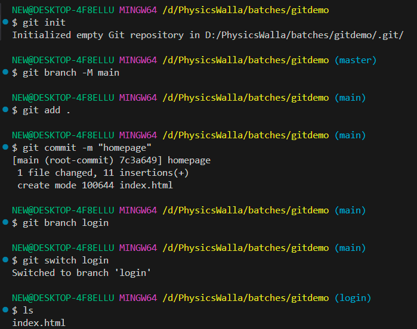
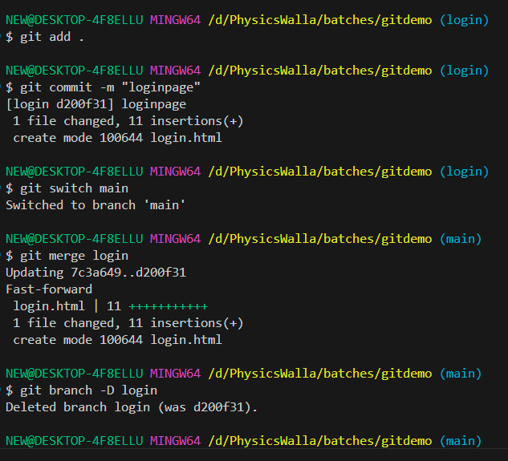
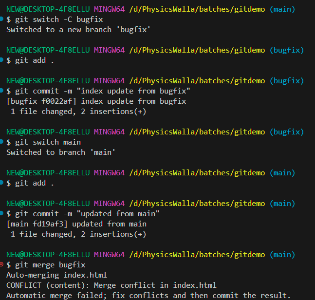

# Branching

- how to work with branches
- open previously created folder in git bash
- run command: git branch
- you can see branch master with * symbol means we have one branch which is master and * indicating current.

- change branch name from master to main
- git branch -M main
- now you can see branch name is main

**How to create**

- git branch login (it will create branch named login)
- git branch (you can see branch * infront of main branch)

**Switch to login branch**
- git switch login
- create login.html file and add some content
- stage it: git add login.html
- commit: git commit -m "login page"

- git switch main (you can see login.html nit visible here)
- git switch login (login.html now visible)

- if you have tested feature and all good then you can merge
- git switch main
- git merge login (merge with login branch)
- now you can see login.html in main branch

- now if no need for login branch you can delete
- git branch -D login (it will delete login branch)

- Execution: Step By Step

## Merge Conflict

- let's say there is bug in index.html
- now 2 dev changing same code
- one is updating from bugfix branch
- another one is updating from main branch

- create branch and switch to that branch
- git switch -C bugfix

- let's make changes to index.html
- add some 2 paragraphs
- stage it: git add .
- commit it: git commit -m "changes from bugfix"

- git switch main 
(when you switch you can't see changed code from bugfix branch)

- edit index.html with some paragraph
- stage: git add .
- commit: git commit -m "index updated"

- now merge: git merge bugfix

(you can see conflict)

- we can resolve conflict manually by editing file in notepad
- but here you can see option to resolve merge in editor
- click on that accept change 
- complete merge
- left side panel add commit message and click on continue
- this is how you can resolve merge conflict

