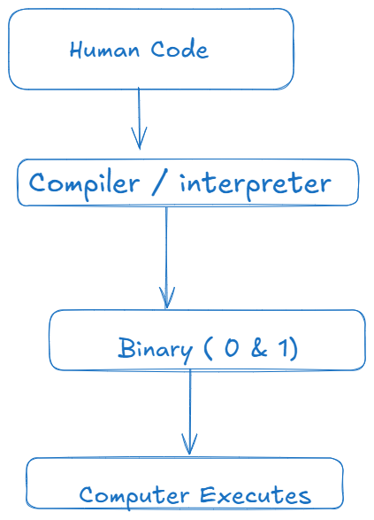
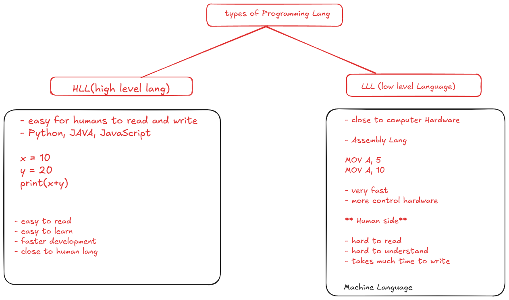
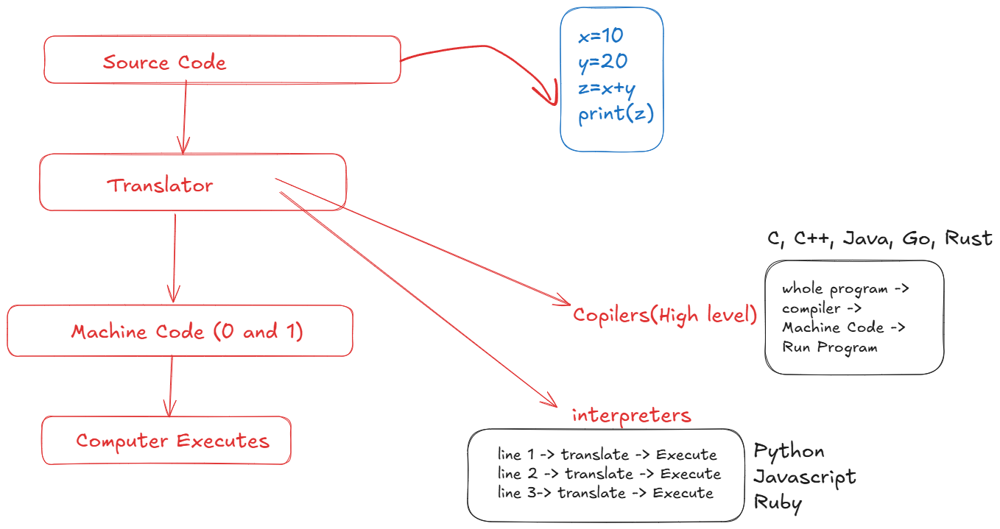
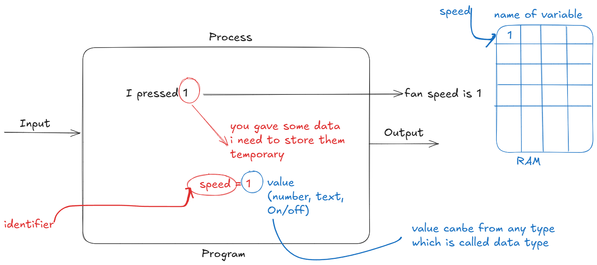
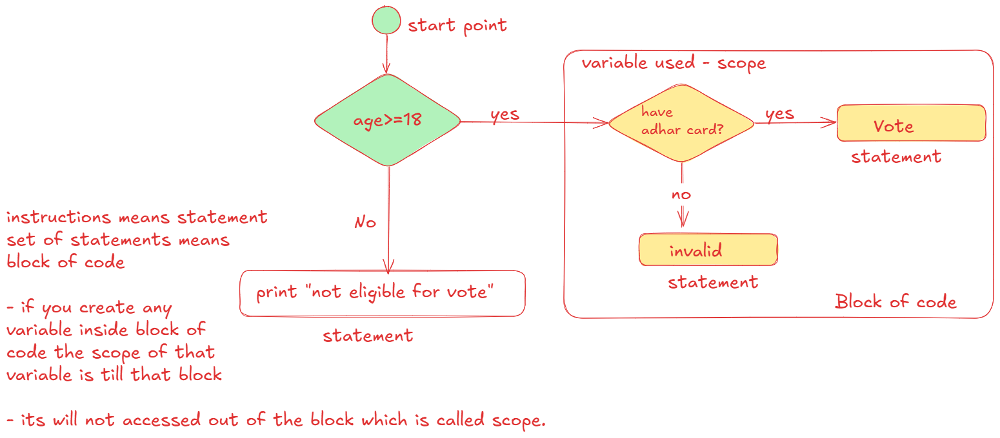

# Why Programming

- Computers cannot think like humans. They only follow the instructions.
- Programming req to give clear instruction to computer what exactly to do.
- eg. calculate salary, send an email, play music
- for each task we need to give instructions.

*Those instructions are called Program*

*Those sequence of steps called algorithm*

## Why Programming languages needed

## HLL & LLL

## Code to Execute

## Identifier

## block and Scope

### comments

- non executable statements are called comments
- why to use?
    + for our understanding of code