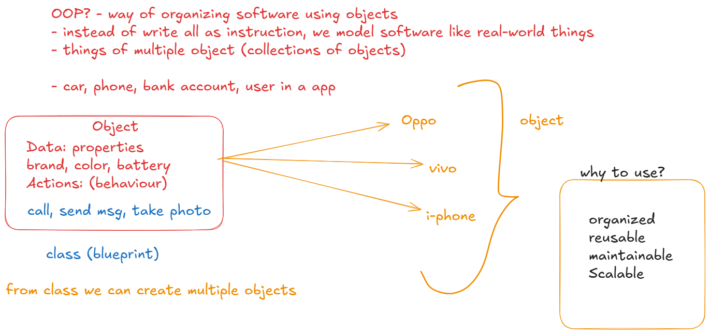
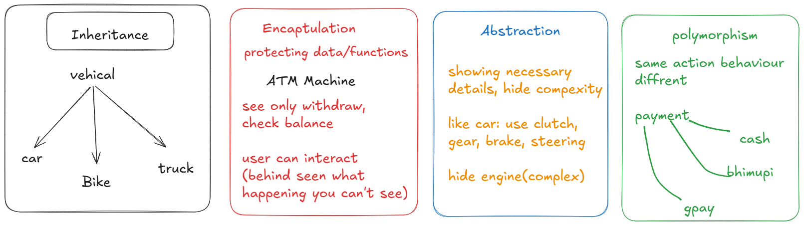
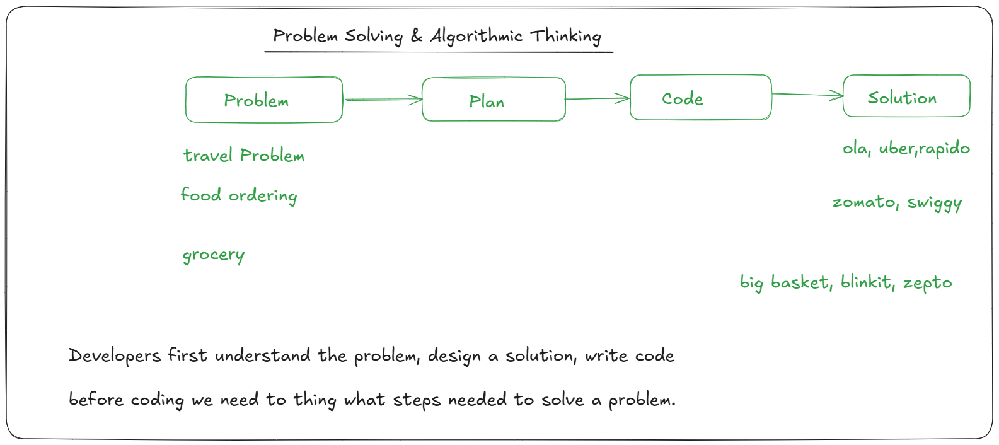
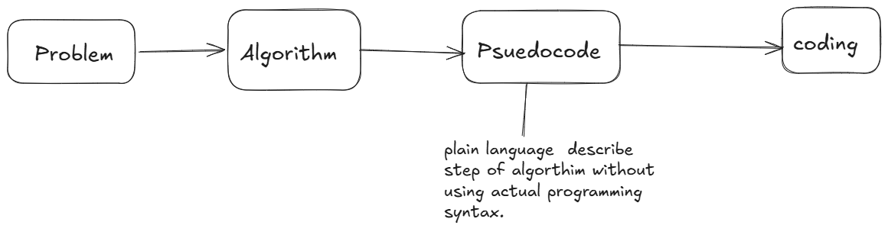
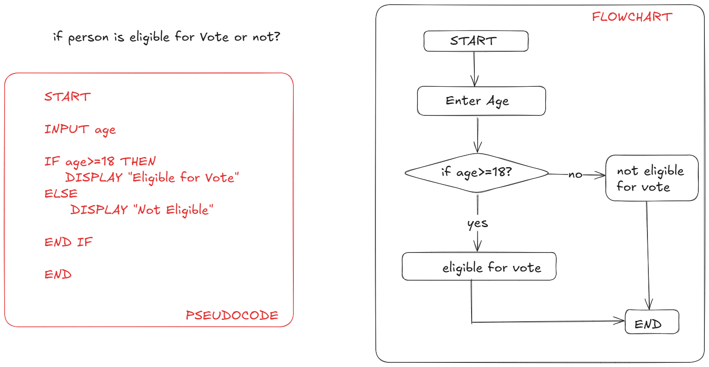
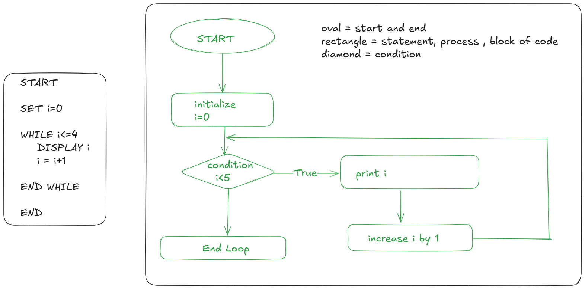

# OOPs





## Problem Solving



## Practice Task

1. Write Algorithm for withdrawing money from an ATM
2. Algorithm for sending an email
3. Algorithm for making maggi
4. Algorithm for unlocking phone
5. Algo. for adding a post on instagram

## How algorithm is written

1. problem: given a number, determine whether the number is even or odd.
    - think
    - if number is divisible by 2 its even
    - if number is not divisible by 2 its odd

2. Input output thinking

    - input: any number
    - output: Even or odd

3. write steps in plain english

    - start
    - take a number as input
    - check number is divisble by 2
    - if yes -> the  number is Even
    - otherwise -> the number is odd
    - show the result
    - end

4. Visual Think
    - user enters a number (8)
    - programs check divisibility by 2
    - Even or Odd
    - display the result (even)

### Practice Task:

- A store gives a discount if the purchase amount is greater than 1000.
- we need to determine if a customer gets a discount or not.

## What is Pseudocode



### Let's Convert Above algorithm into pseudocode

```md
START

INPUT number

IF number is divisible by 2 THEN
    DISPLAY "EVEN"
ELSE
    DISPLAY "ODD"

END IF

END
```
## Task

- Write Psuedocode for below problem:
- Give Discount if purchase amount is greater than 1000.

```md
START

INPUT amount

IF amount > 1000 THEN
    DISPLAY "Discount applied"
ELSE
    DISPLAY "No Discount"

END IF

END
```

- Example



## pseduocode for loop using WHILE

```md
START

SET i = 1

WHILE i<=5
    DISPLAY i
    SET i = i+1
END WHILE

END
```

