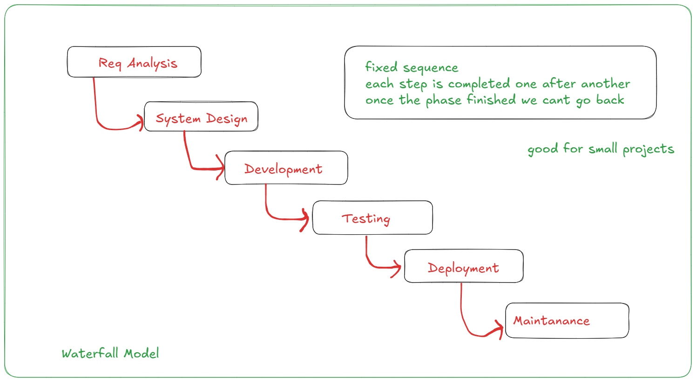
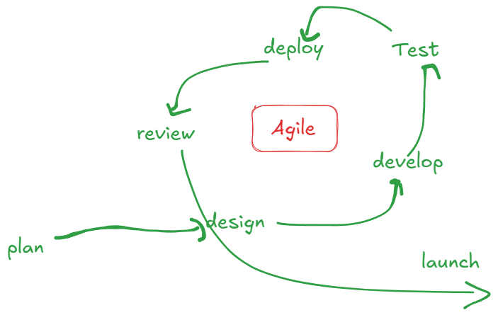
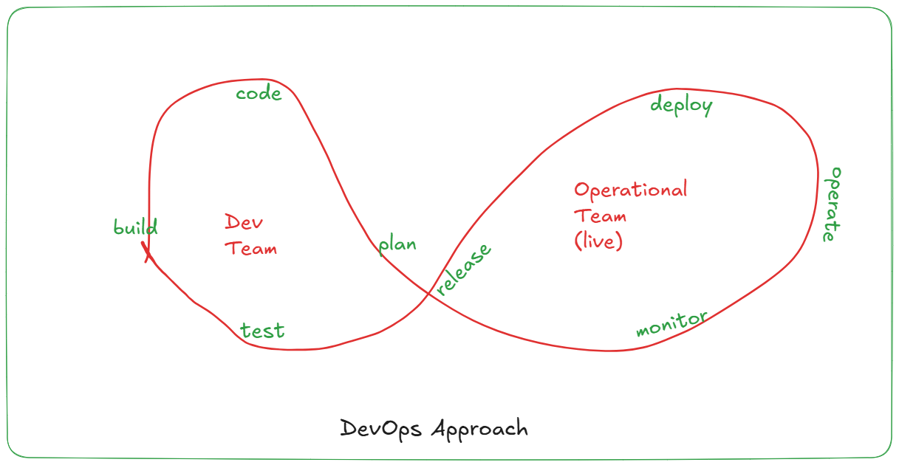

# SDLC 

- software development lifecycle
- step by step process which is used to build a software in a organized and systamatic way.

- think about you are building a house:
    - understand requirement
    - create a design
    - build a house
    - inspect it
    - maintain it

### SDLC also following same steps:

1. Req. analysis
    - what is the problem?
    - what features you want?
    - who will use the software?

    e.g: car booking app

    - user login
    - enter pickup location, destination location
    - book a cab
    - driver confirms
    - trask driver
    - online payment / cash

2. System Design

    - UI design
    - storage design (database design)
    - technology selection

3. Development (coding)

    - write actual code

4. Testing

    - check codes working or not
    - check features working or not

5. Deployment

    - upload the code on servers
    - so users can access
    - launch a website, launch an application/ mobile app

6. Maintanance

    - fix bugs
    - improve performance

