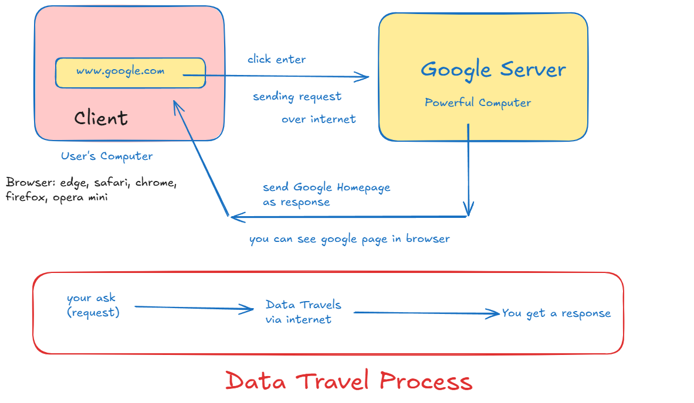
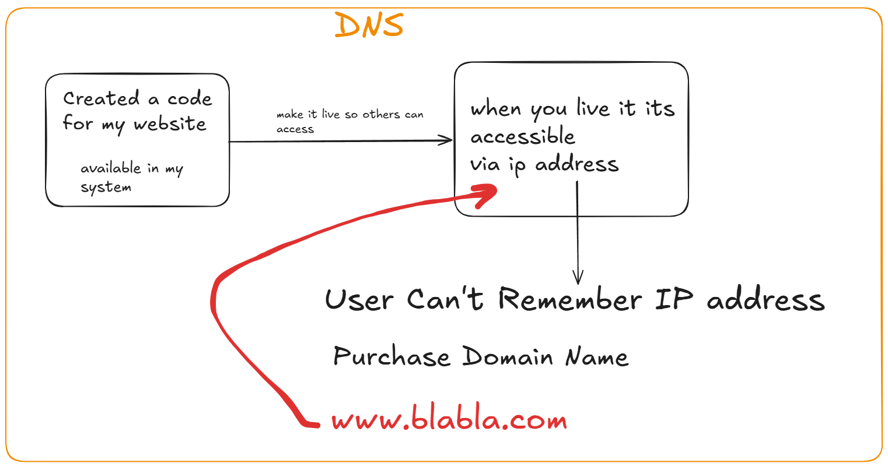
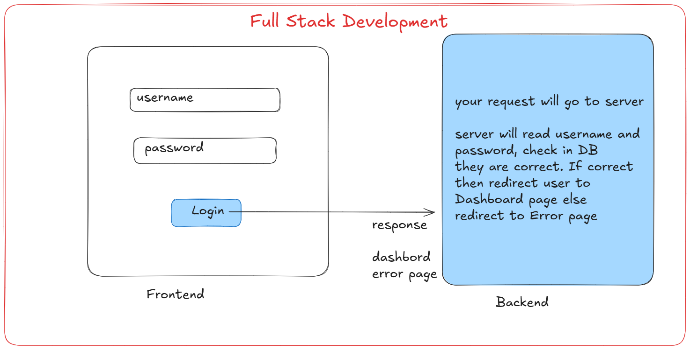

# What is Internet

# Fullstack Development

## Cloud Service

1. IaaS: infrastructure as Service

- Service Provider will provide infra no need to setup manually
- who provides 
    + AWS
    + GCP
    + Azure
- if you set up manually:
    + set up your own servers (machines/comupters)
    + software installtion
    + storage (place to keep them)
    + computation power
    + 24*7 internet
    + cooling system
    + resources (employee) to take care of all this

*we can use someone service directly by renting it using cloud computing*

*Pay as much as you use*

## PaaS (Platform As a Service)

- its a cloud Model

**without PaaS**
- in my local system if i want to code for any programming language
- like Java, python
- install related softwares
- i need to install IDE (integrated development environment)
- security paches of softwares
- version updates

**With PaaS**

- Just write code we will handle everything.

### Examples:
- Heroku
- Google App Engine
- Azure App Service
- AWS Elastic Beanstack

### SaaS (software as a service)

- just use a complete application over the internet
- no installation, no setup, no maintanance

**Examples**

- Gmail, Google Docs, zoom

- no installation required, accessible from anywhere, automatic udates, Subscription based

### Real Life Analogy

- IaaS = provides infra (kitche + raw material)
- PaaS = provided kitchen to someone for cooking
- SaaS - ordering food online (just eat)