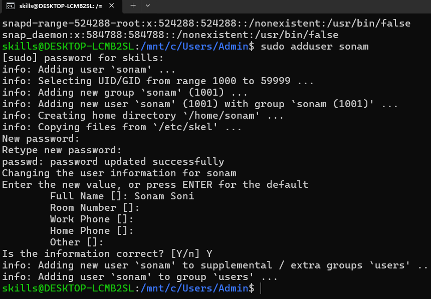

# User management in Linux

- we can see users at /etc/passwd location
- cat /etc/passwd

- create new user

- cat /etc/passwd
- verify using grep:
- cat /etc/passwd | grep "sonam"

**Change password**

-  sudo passwd sonam
- enter new password, retype and update

**delete user**
- sudo deluser sonam
- cat /etc/passwd | grep "sonam" (you cannot see anything)

## User Switch

- create user sonam
- switch: su sonam
- enter password
- you can see user updated
- go back: su skills
- enter password (you logged in with regular user)

## Create Group

- sudo groupadd developer (create group)
- cat /etc/group  (check created group)
- sudo usermod -aG developer sonam (add user to group)
- groups sonam (you can see list of group where sonam is)

## File permission

- r read (4)
- w write (2)
- x execute (1)

- first permission is for owner
- second permisson is for group
- third permisson is for others

- drwxr_xr__  = (754)
- means its a directory where owner can read write execute
- group can read and execute
- other can only read

- _rw_r__r__ = (644)
- means its a file where
- owner: read and write
- group: only read
- other: only read

- my file is having 777 permission
- my file is gaving 644 

**How to change permission**

- ls -l data.txt
- chmod 755 data.txt
- ls -l data.txt (you can see update permissions)

