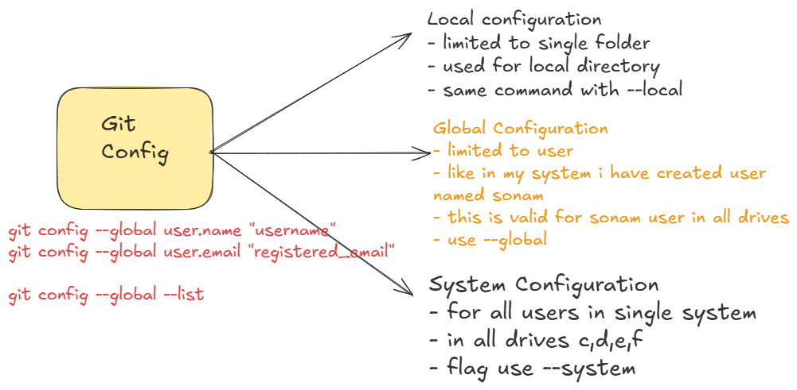
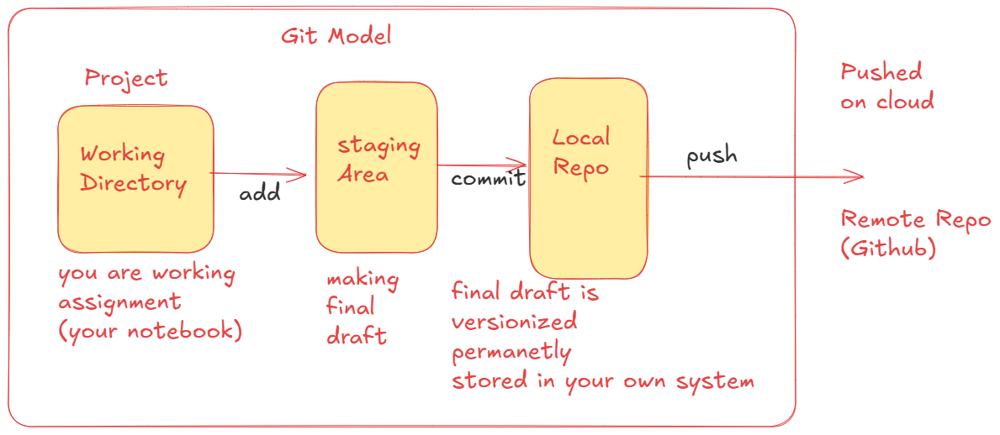
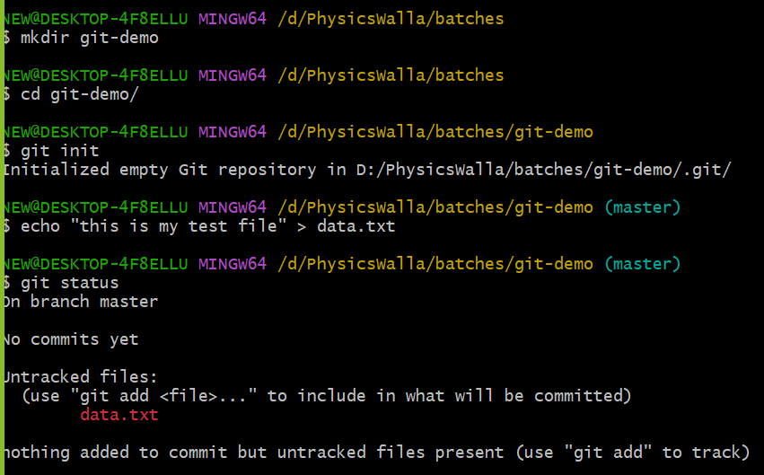
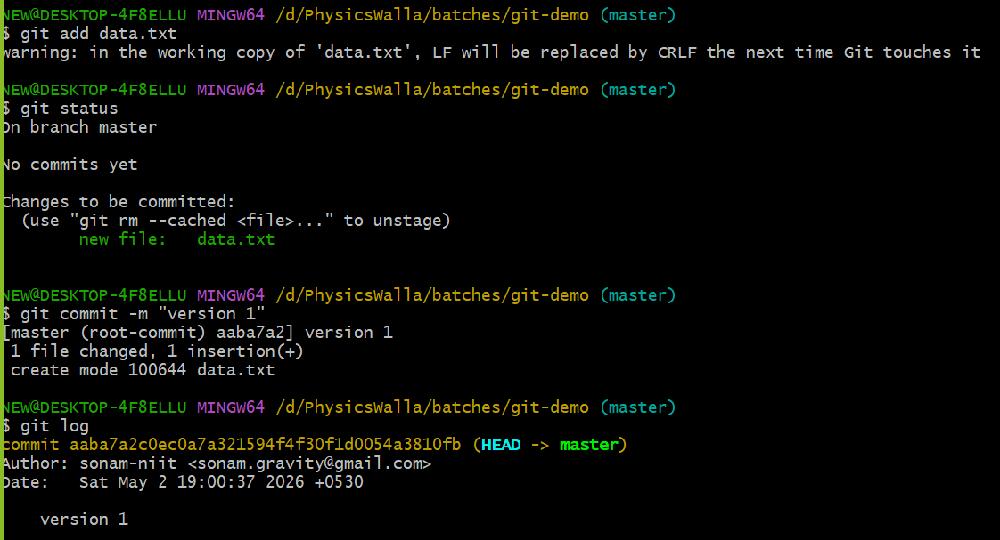
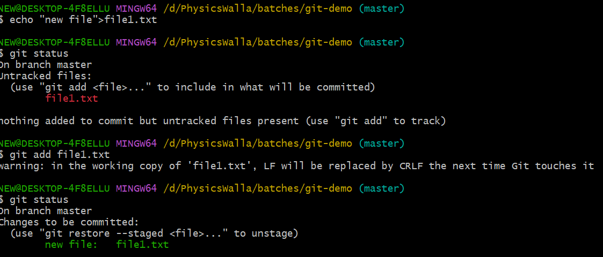
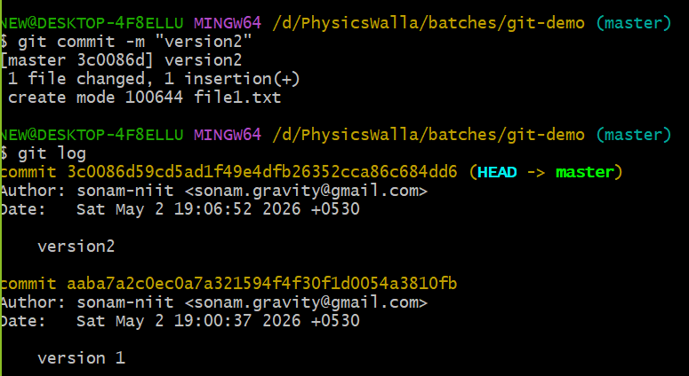

# Git Configuration

- configuration can be done in 3 types



```bash
git config --global user.name "your_username"
git config --global user.email "your_email_id"

git config --global --list
```

# Git Model



# Let's Execute using Command

- create folder (mkdir git-demo)
- move to the folder (cd git-demo)
- initialize repo (git init)
- this command creates hidden folder called .git which track all files records, commit history and staging info
- create file (echo "this is test file" > data.txt )
- check status: git status
- you can see here your file is not tracked yet



- add file to staging area: git add data.txt
- check status: git status
- if all good add to commit: git commit -m "version1"
- check commit hostory: git log (you can see all details)



- let's say if you update your contet repeat the same process
- create new file
- add file to stage area using add command
- commit using commit command and give message like version2



- commit and check commit history

