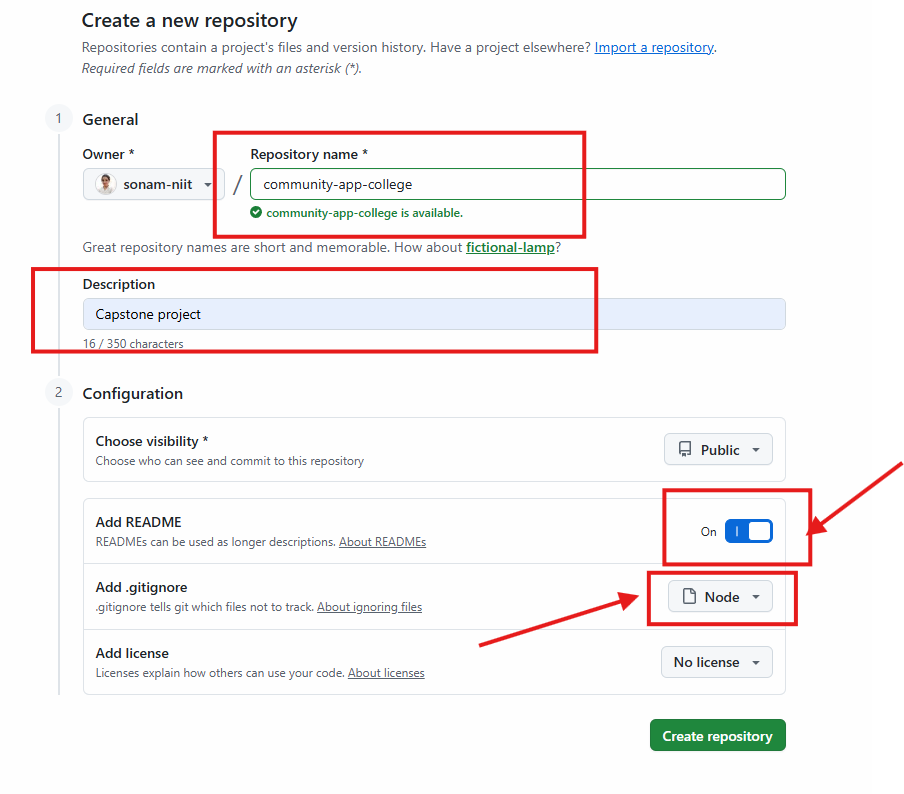
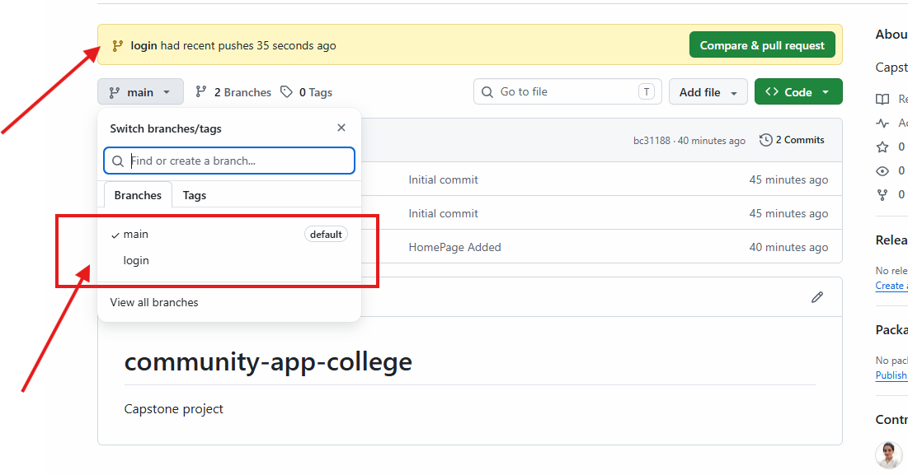

# How to work on Project

- Now if you want to work on new project
- go to github and create new Repository with ReadMe with Gitignore

- clone your Project to Local Repository
- open project in VS Code
- now add some code files
- stage it (git add .)
- commit it (git commit -m "message")
- push it (git push)

## How to collab here

- git switch -c login
- create login.html (add some few lines of code)
- git add .
- git commit -m "login feature completed"
- git push origin login

(codes pushed on login branch not to main)

- If all good you can generate Pull Request
- later verify and click on merge
- if there is no conflict, if merge done add message and commit.
- then refresh repo and check login.html is visible in main branch

- for adding colloborator to the project
- in repository - click on setting - left hand side panel you can see
- colloborator option -> click on that and add people
- add username of your friend/collegue 
- send invite
- yout friend can see email , confirm invite
- once he confirm he/she will be  colloborator to your project
- means now he can clone repository and then work on his own branch
- push the  code to his//her  branch