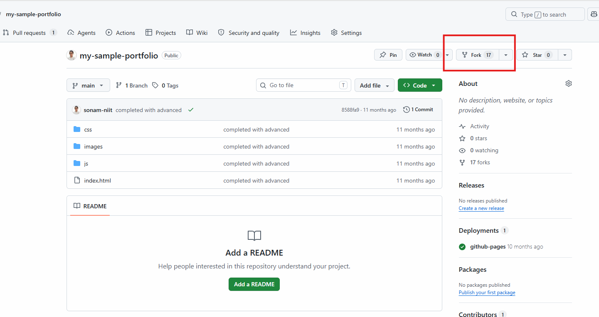
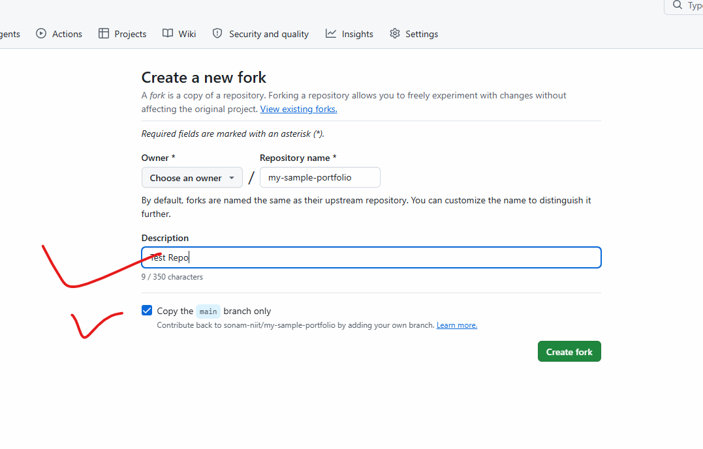
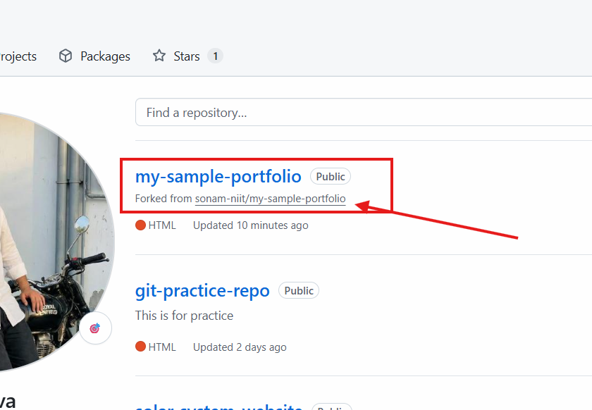

# How to fork

- when you want to make a copy of someone's project to experiment we can fork repo.
- of if you want to contribute your idea to community you can fork.
- whatever repository you want to fork just go to that repo and click on form button.

[Sample Repo Link](https://github.com/sonam-niit/my-sample-portfolio)

- once forking is done you can see the copy of same repository to your account
- looks like this in your account

- so now you need to clone that copied repo link to your system
- move to the project folder
- create new branch
- git switch -c feature-change
- make some change to any file
- stage it : git add .
- commit : git commit -m "changes done by XYZ"
- push from your branch: git push origin feature-change

- go to repository, refresh
- check you can send pull request
- this pull request received by the owner